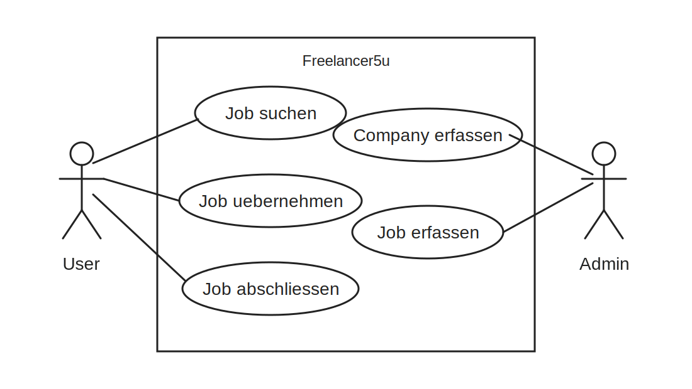

# Freelancer5u

Freelancer5u ist ein vereinfachtes Job-Portal fuer Freelancer aus dem Bereich
Softwareentwicklung.

Es werden zwei Rollen unterschieden:
- **Admin**: Kann Companies und Jobs verwalten.
- **User**: Kann Jobs suchen, uebernehmen und abschliessen.

